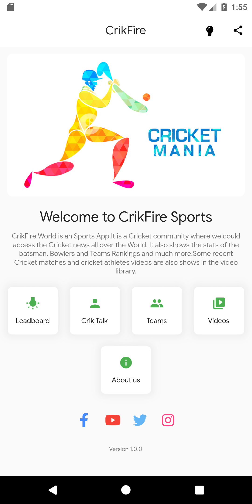
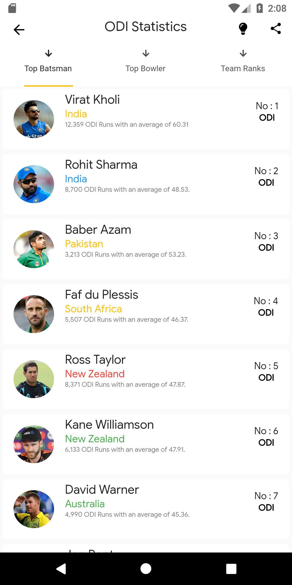
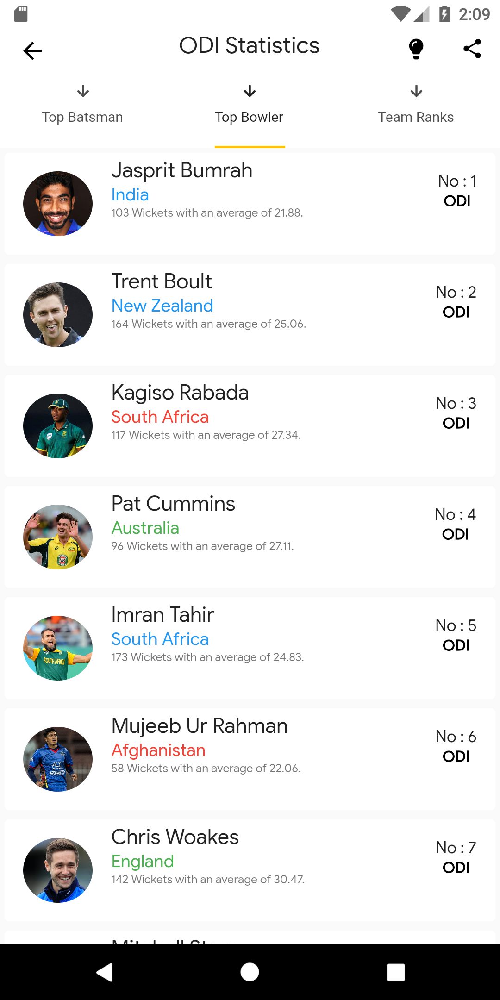
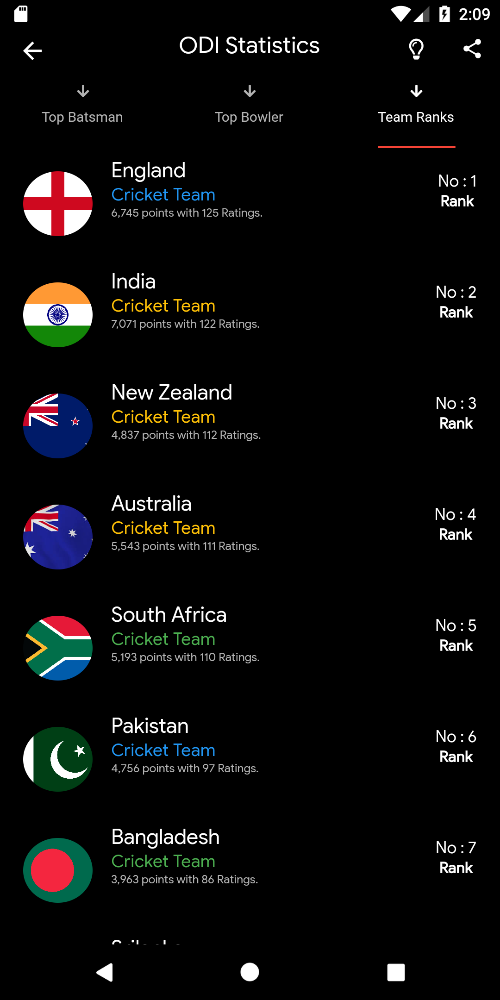
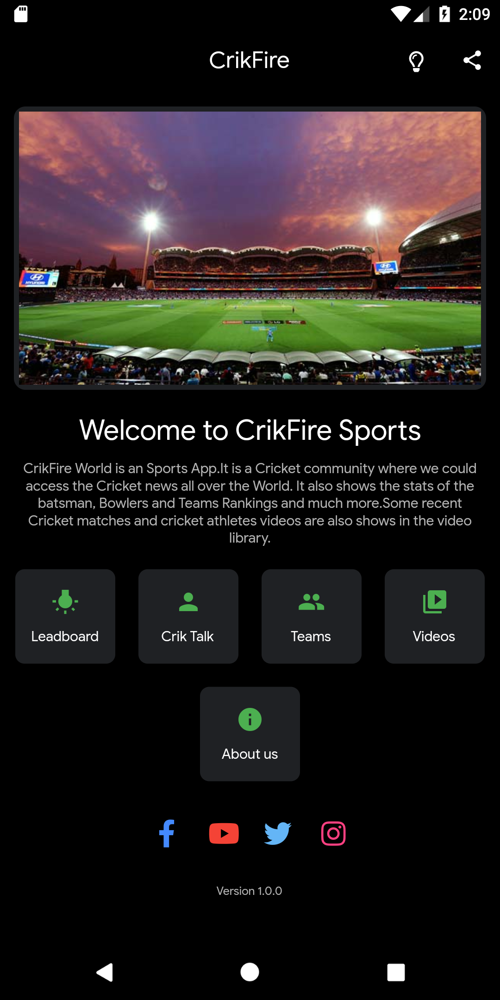
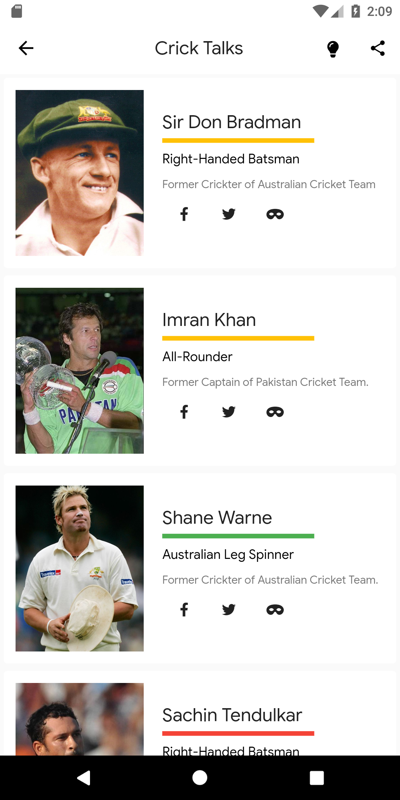
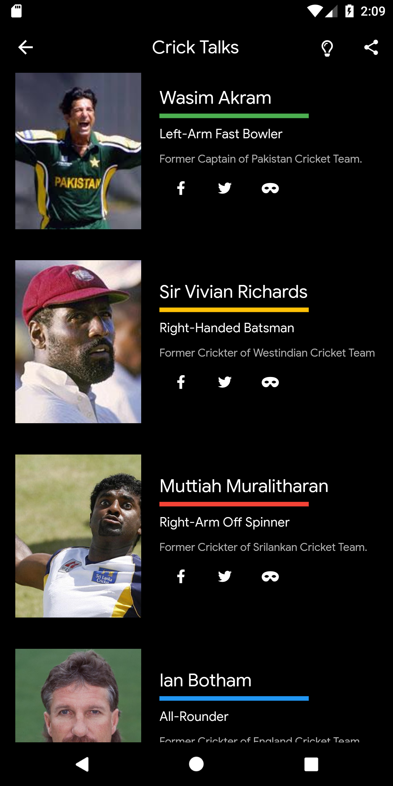

# crickfire

A new Flutter project.

## Getting Started

This project is a starting point for a Flutter application.

A few resources to get you started if this is your first Flutter project:

The project is a Cricket app consits of Odi rankings and Ranks and further more

    

        
    

    

        
    

    

        
    

    

    

        
    

    

        
    

    

        
    

